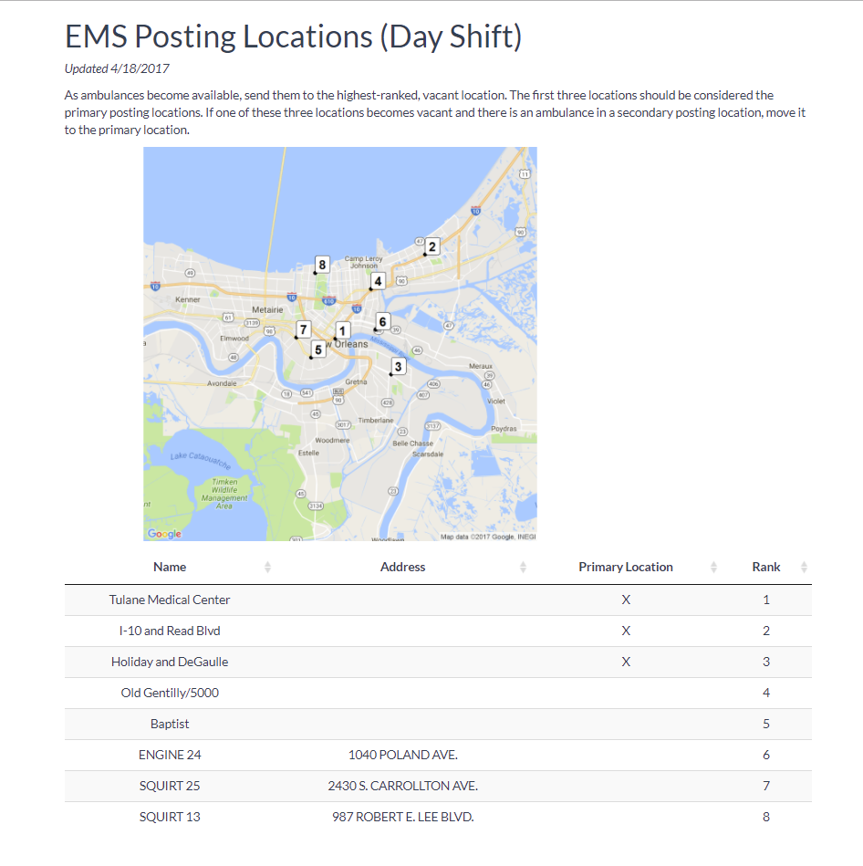

# EMS Ambulance Placement Optimization  

## Project Summary  

This repository contains the code used to optimize EMS posting locations.

In an effort to promote faster, more reliable, and more equitable response times to health-related 911 calls in the face of demand for its services, New Orleans Emergency Medical Services (NOEMS) worked with OPA to develop a new, data-driven ambulance placement protocol.  In partnership with LSU analytics graduate students, OPA developed an optimization algorithm that ranked locations by potential impact, incorporating daily and weekly patterns in traffic, 911 calls, and ambulance availability.  The result was a prioritized list of locations to place ambulances during day shifts (assuming high traffic and daytime 911 call patterns) and the night shifts (assuming low traffic and nighttime 911 call patterns, which concentrate in the French Quarter and Central Business District).

 

Analysis of 911 data shows that since the new protocol was implemented, there are more equitable response times across districts, with the largest gains (15%) in the proportion of calls within response times standards (12 minutes) coming in the 4th district (West Bank), the area of the city with the historically slowest response times. Response time compliance in the 7th district (New Orleans East), a district with historically slower response times, also improved substantially (9%).  In addition, the new protocol led to modest, statistically significant improvements in citywide response times during the night shifts. During the day shifts, there were no overall statistically significant improvements in response times. However, equity in response times across districts improved.

[Full Report on EMS Ambulance Posting Location Optimization](http://datadriven.nola.gov/datadriven/media/Assets/Presentations/EMSpostinglocationanlayticsbriefingJune2017.pdf)

## Methodology  

OPA started with a list of 55 candiate locations where ambulances can be conveniently stationed around New Orleans.  For each of these locations, 8-minute "drive-time polygons" were created using ArcGIS online.  These shapefiles delineate for each candidate location the area of the city that an ambulance can reach within 8 minutes (see image below).  Locations are prioritized according to historical trends in call volume.  See rmd/calculate_postings for full details on the algorithm (including an interactive R notebook).

## Results  

The maps currently in use are displayed below. For analysis of impact of new placement protocol, please see the R notebook rmd/analysis.

